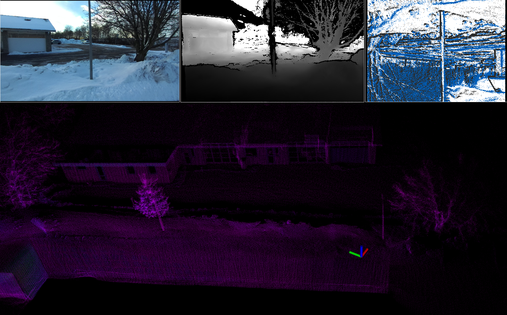

# FROST: Fusion and Multimodal 3D Reconstruction of Icy Surfaces for Robotic Exploration

## Abstract
Three-dimensional (3D) reconstruction serves as a cornerstone in various robotic applications, playing critical roles in scene understanding and navigation. Traditionally, LiDAR has been instrumental in generating precise point clouds of the environment, providing essential data for these applications. However, the efficacy of LiDAR sensors is significantly hindered in challenging conditions, such as the presence of water or icy surfaces. The complex interplay between laser beams and icy or non-ideal surfaces can result in signal degradation, distortion, or even complete signal loss, adversely affecting the accuracy and reliability of the 3D reconstruction process. The reflective and refractive properties of ice, along with its variable surface conditions, present challenges that traditional LiDAR sensors struggle to address. This paper proposes a diverse dataset to facilitate a multimodal approach for reconstructing icy surfaces using various sensors. A preliminary study based on this dataset demonstrates the feasibility of combining the geometric surface obtained from consecutive LiDAR scans with reconstructed meshes from visual cameras. The integration of distinct data sources has the potential to improve the robustness of reconstruction algorithms in diverse scenarios. The dataset can be downloaded at https://zenodo.org/records/13862009.

## Download link
You can access the dataset [here](https://zenodo.org/records/13862009). We will keep updating the dataset

## Citation
If you use this dataset in your research, please cite the following paper:

